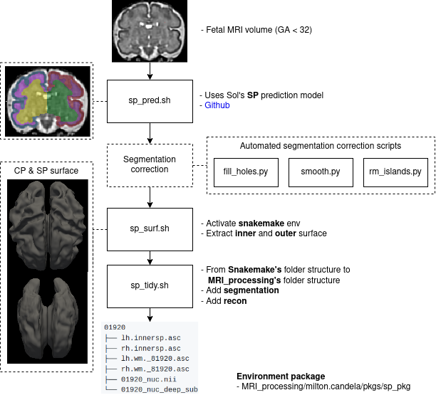

# fetal_subplate
<div align="center">

</div>

## Package
```shell
. milton.candela/pkgs/sp_pkg
```

## Scripts (bin)
- fetal_subplate_seg_pred_att.py
- fetal_subplate_seg_pred_noa.py
- deep_util_sp.py

## Libraries
- numpy: 1.21.5
- nibabel: 5.1.0
- python_abi: 3.9

## Commands
- sp_pred.sh
- sp_surf.sh
- sp_tidy.sh

## Final structure

```shell
fetal_sp
├── scripts
│   ├── sp_pred.sh
│   ├── sp_surf.sh
│   └── sp_tidy.sh
├── weights
│   ├── att
│   │   ├── axi.h5
│   │   ├── cor.h5
│   │   └── sag.h5
│   └── noa
│       ├── axi.h5
│       ├── cor.h5
│       └── sag.h5
├── subjects
│   ├── 01920
│   │   └── recon_segmentation
│   │       └── recon_to31_nuc.nii
│   └── ...
└── surfaces
    ├── 01920
    │   ├── lh.innersp.asc
    │   ├── rh.innersp.asc
    │   ├── lh.wm._81920.asc
    │   ├── rh.wm._81920.asc
    │   ├── 01920_nuc.nii
    │   └── 01920_nuc_deep_subplate_dilate.nii
    └── ...
```
